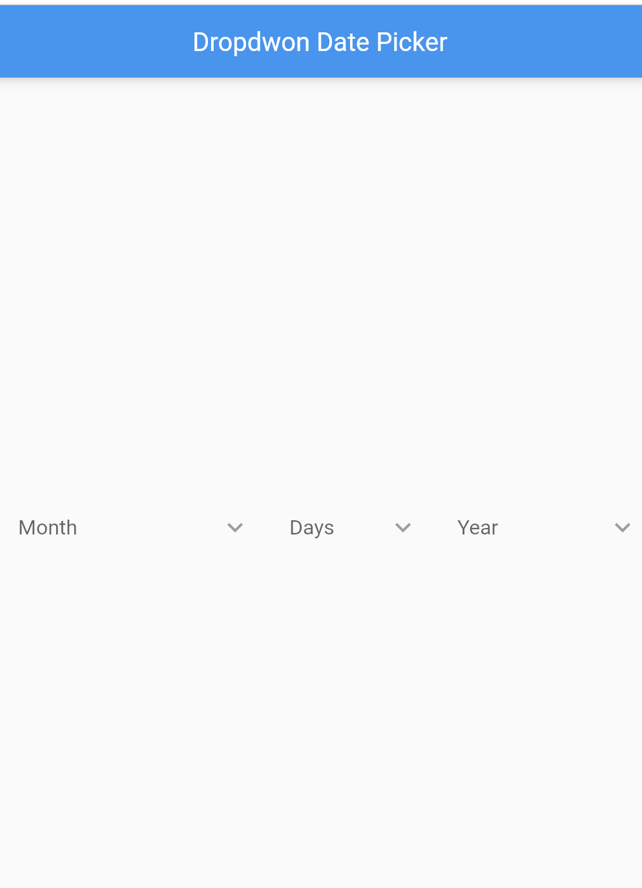
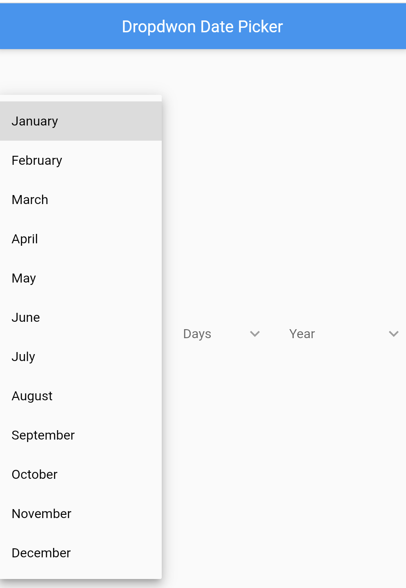
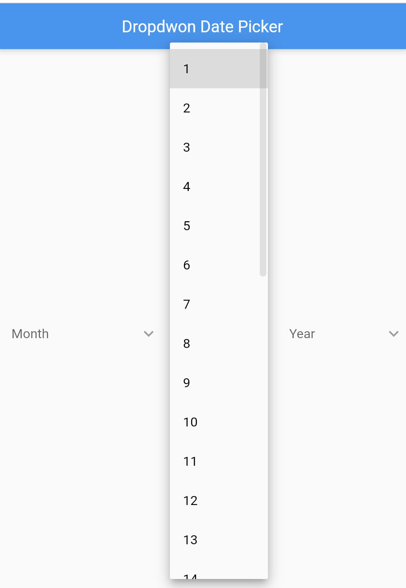

<!--
This README describes the package. If you publish this package to pub.dev,
this README's contents appear on the landing page for your package.

For information about how to write a good package README, see the guide for
[writing package pages](https://dart.dev/guides/libraries/writing-package-pages).

For general information about developing packages, see the Dart guide for
[creating packages](https://dart.dev/guides/libraries/create-library-packages)
and the Flutter guide for
[developing packages and plugins](https://flutter.dev/developing-packages).
-->

## Dropdown Date Picker

A Dropdown Date picker for Flutter with customizable options.

 
 

## Features

TODO: List what your package can do. Maybe include images, gifs, or videos.

## Getting started

DropdownDatePicker();

## Usage

For example [Example](https://github.com/Robertrobinson777/dropdown_date_picker/tree/master/example)

```dart
DropdownDatePicker(
        isDropdownHideUnderline: true,
        startYear: 2000,
        endYear: 2020,
        width: 10,
        onChangedDay: (value) => print('onChangedDay: $value'),
        onChangedMonth: (value) => print('onChangedMonth: $value'),
        onChangedYear: (value) => print('onChangedYear: $value'),
      )
```

## GitHub source code

If you're interested on the code (feel free to modify it anyway you want), you can find it here: [https://github.com/Robertrobinson777/dropdown_date_picker](https://github.com/Robertrobinson777/dropdown_date_picker)
